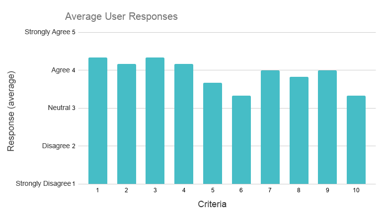

# Peer Testing 1

## Results

| Criteria                                                     | Average Response |
| ------------------------------------------------------------ | ---------------- |
| The system design affords good visibility of system system.  | 4.33             |
| The presentation of information and objects in the system resemble things are in the real world. | 4.16             |
| The system allows the user to maintain control and provides the user with freedom to do what is needed. | 4.33             |
| The system's design is consistent with how other software is designed. | 4.16             |
| The system has mechanisms in place to helps me not make mistakes when using it. | 3.66             |
| I can figure out what needs to be done in the system even if I can't remember exactly what the commands are. | 3.16             |
| To complete a task in the system, I have a choice in the commands I use. | 4                |
| The design of the system is simple, clear, and aesthetically pleasing. | 3.83             |
| To complete a task in the system, I have a choice in the commands I use. | 4                |
| When I get stuck, the system has help and documentation to help me figure out what I need to do. | 3.33             |

### Individual Responses

| Criteria | User 1 | User 2 | User 3 | User 4 | User 5 | User 6 | Average |
| -------- | ------ | ------ | ------ | ------ | ------ | ------ | ------- |
| 1        | 4      | 3      | 4      | 5      | 5      | 5      | 4.33    |
| 2        | 4      | 4      | 4      | 5      | 5      | 3      | 4.16    |
| 3        | 4      | 4      | 4      | 4      | 5      | 5      | 4.33    |
| 4        | 4      | 2      | 4      | 5      | 5      | 5      | 4.16    |
| 5        | 3      | 2      | 3      | 4      | 5      | 5      | 3.66    |
| 6        | 3      | 2      | 4      | 3      | 5      | 3      | 3.33    |
| 7        | 4      | 3      | 4      | 3      | 5      | 5      | 4       |
| 8        | 4      | 2      | 4      | 3      | 5      | 5      | 3.83    |
| 9        | 4      | 3      | 4      | 3      | 5      | 5      | 4       |
| 10       | 3      | 2      | 3      | 4      | 5      | 3      | 3.33    |

