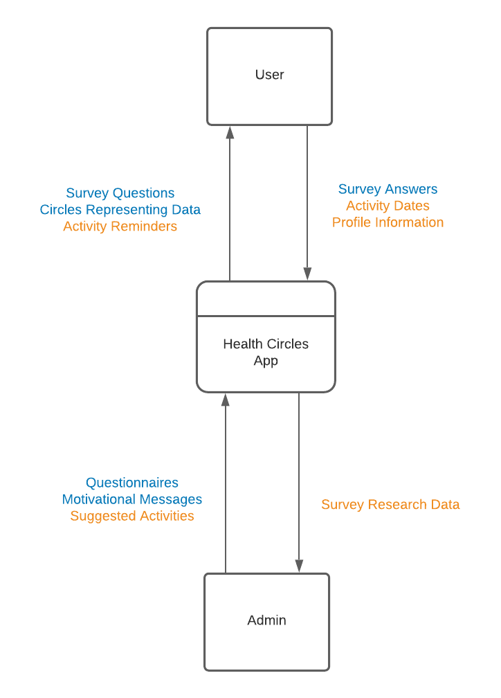
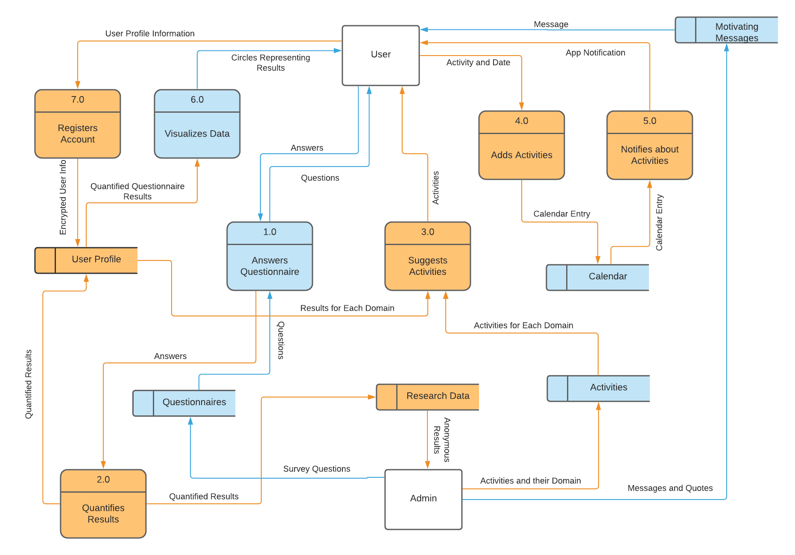

# System Architecture Overview

## Data Flow Diagram Level 0

The Level 0 diagram shows that the system at the Peer Testing #1 milestone receives survey answers from the user and questionnaires and motivational messages from the administrator. The user receives survey questions and circle visualization representing their data from the system. At the Peer Testing #2 milestone, the user will also provide dates for activities they choose to do, and their profile information when they register for a user account. The administrator will provide suggested activities for the user. From the system, the user will receive notifications of activity reminders.The admin will receive anonymized survey research data.

Components for the Peer Testing #1 and #2 milestones are blue and yellow respectively.

## Data Flow Diagram Level 1

The Level 1 diagram expands upon the Level 0 diagram to show that in Peer Testing #1, the questionnaires inputted are stored locally on the device. Answering a questionnaire is defined as a process, because the answers inputted by the user will be converted to numbers to represent their answers. For this milestone, we will populate data stores with activities and calendar events for UI design and testing purposes. The admin will be able to input motivating messages and quotes into a data store that wil be displayed to the user. For the Peer Testing #2 milestone, the user will input their information to register for an account, which is stored in the user profile data store. The results from questionnaires will be quantified to determine the user's well-being in each domain (social, emotional, physical, mental, spiritual). These results will be outputted to both the research data store, where they can be viewed by the admin, and to the user profile, where they will be further processed into data visualizations to be viewed by the user. In this phase, the activities and calendar data stores will be able to receive data from the admin and the user respectively. The calendar will then output notifications of the activities to the user. In order to suggest activities to the user, survey results from the user profile are combined with data from the activities data store to make suggestions of activities that are relevant to the user's domains of well-being.

Components for the Peer Testing #1 and #2 milestones are blue and yellow respectively.

In the month between Peer Testing #2 and our Final Submission, we intend to add additional functionality to existing components, such as help pages or a tutorial. However, there are no components labelled for this milestone, because we do not plan to make major changes to the system architecture that late in the process.