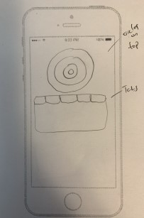
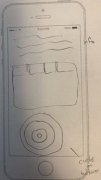

# Circle Visualization Issues

## What doesn't work

- overlapping with concentric circles is an issue. When there is minimal difference between circles, there's no way to touch/click directly on a circle
- buttons over top of circles were not clearly buttons that could be clicked on to do anything.
- buttons weren't fitting on all screens
- bottom buttons purpose isn't clear (or even decided), some can go already

## Potential solutions/ideas

- circles go on top or bottom of page
  
  
- top buttons get moved to act as tabs to main "info" button
- circles are changed

  1. overlapping stacked circles
     
  2. randomly placed non-overlapping circles
     
  3. olympic ring style
     
  4. keep concentric, but sizes are set to not change with score, just change order

- button opacity changes, lighter opacity when not clicked, potentially buttons AND circle opacity
- border/highlight changes, make darker, give border
- ditch bottom buttons outside of main information so there's less on screen, put these options on another page or only after doing a survey then prompt

- major design change could be to hide the visualization behind the surveys, can't get there directly from Nav, only by completing or clicking through from the survey page

- make an intro, expect tutorial to explain it better so no/minimal changes are needed
