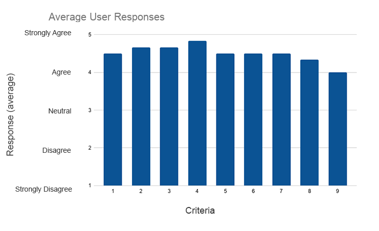

# Quantitative Scores

| Criteria | Description                                                  | Average Response |
| -------- | ------------------------------------------------------------ | ---------------- |
| 1        | The system design affords good visibility of system functionality. | 4.5              |
| 2        | The presentation of information and objects in the system resemble how things are in the real world. | 4.67             |
| 3        | The system allows the user to mantain control and provides the user with freedom to do what is needed. | 4.67             |
| 4        | The system’s design is consistent with how other software is designed. | 4.83             |
| 5        | The system has mechanisims in place to help me not make mistakes when using it. | 4.5              |
| 6        | I can figure out what needs to be done in the system even if I can’t remember exactly what the commands are. | 4.5              |
| 7        | To complete a task in the system, I have a choice in the commands I use. | 4.5              |
| 8        | The design of the system is simple, clear, and aesthetically pleasing. | 4.33             |
| 9        | When I get stuck, the system has help and documentation to help me figure out what I need to do. | 4                |