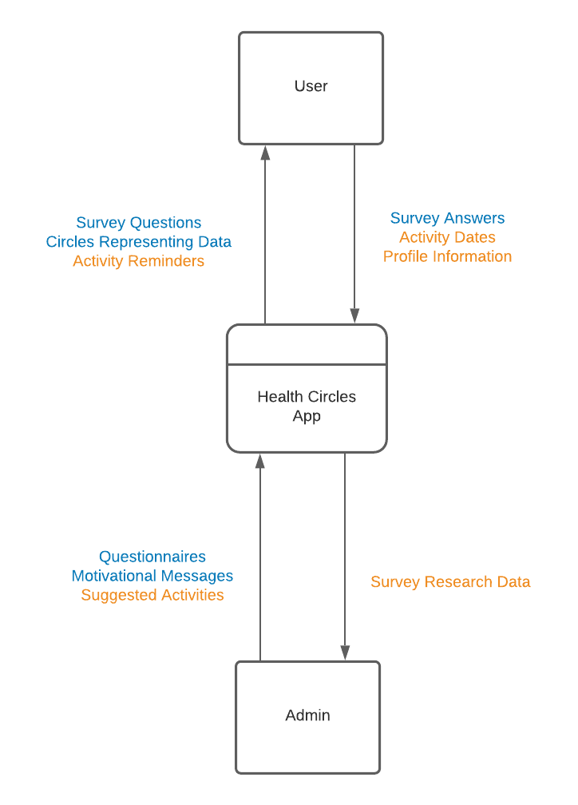
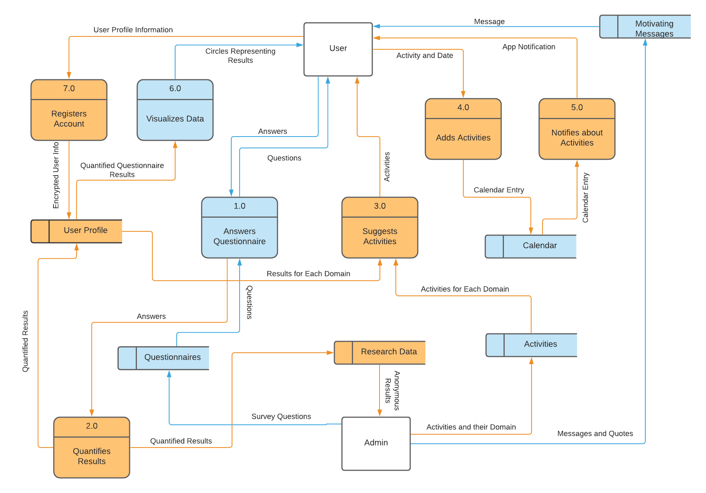

#   Requirements Report - Dawson Psychological Services A
### Michael Crouse, Meredith Lister, Lucas Pozza
### COSC 499
### 21 October 2020

# Description
## Description of the Software

The Health Circles mobile site encourages users to have a holistic view of their own mental health. Users answer questions to quantifiably describe their well-being in several different domains (physical, mental, emotional, social, spiritual) which are represented visually as overlapping circles. Based on their results, users are recommended activities to add to their calendar to improve their well-being. Admins may add new questions or activity suggestions over time.

## User Groups

1. Clients
These users are clients of Dr Dawson and use the app for their own benefit, as well as to share insights with Dr Dawson.

2. Other Users
These are people who do not work with Dr Dawson but are interested in improving their own mental health.

3. Admin
This user is Dr Dawson, who can add new questions or activity suggestions. He can also see information shared by his clients.

4. Developers
These users use the application for testing purposes.

# System Architecture
## Data Flow Diagram Level 0

The Level 0 diagram shows that the system at the Peer Testing #1 milestone receives survey answers from the user and questionnaires and motivational messages from the administrator. The user receives survey questions and circle visualization representing their data from the system. At the Peer Testing #2 milestone, the user will also provide dates for activities they choose to do, and their profile information when they register for a user account. The administrator will provide suggested activities for the user. From the system, the user will receive notifications of activity reminders.The admin will receive anonymized survey research data.

Components for the Peer Testing #1 and #2 milestones are blue and yellow respectively.

## Data Flow Diagram Level 1

The Level 1 diagram expands upon the Level 0 diagram to show that in Peer Testing #1, the questionnaires inputted are stored locally on the device. Answering a questionnaire is defined as a process, because the answers inputted by the user will be converted to numbers to represent their answers. For this milestone, we will populate data stores with activities and calendar events for UI design and testing purposes. The admin will be able to input motivating messages and quotes into a data store that wil be displayed to the user. For the Peer Testing #2 milestone, the user will input their information to register for an account, which is stored in the user profile data store. The results from questionnaires will be quantified to determine the user's well-being in each domain (social, emotional, physical, mental, spiritual). These results will be outputted to both the research data store, where they can be viewed by the admin, and to the user profile, where they will be further processed into data visualizations to be viewed by the user. In this phase, the activities and calendar data stores will be able to receive data from the admin and the user respectively. The calendar will then output notifications of the activities to the user. In order to suggest activities to the user, survey results from the user profile are combined with data from the activities data store to make suggestions of activities that are relevant to the user's domains of well-being.

Components for the Peer Testing #1 and #2 milestones are blue and yellow respectively.

In the month between Peer Testing #2 and our Final Submission, we intend to add additional functionality to existing components, such as help pages or a tutorial. However, there are no components labelled for this milestone, because we do not plan to make major changes to the system architecture that late in the process.

# Milestones
## Peer Testing 1

1.  3. Initial questionnaire starts with a terms of service acceptance page
    4. Followed by an information page about what the goals of the app are for the user
    5. Next is a colour scheme selection option, where users can choose from a list of predefined colour schemes, or create their own
    6. Then the user is asked to set a time for daily notifications for a reminder to open the app and check in. This prompts the mobile device to allow push notifications
2. Users do initial health questionnaire, preferably doing all 4 or 5 domains
    1. Users have the option to choose which domains to do the questionnaire for, and then can prioritize domains in order of importance
    2. The questionnaire has general questions to start, followed by each specific domain questions, areas of each domain are self ranked 1-7 (such as sleep rating in the physical domain)
    3. The system will score each domain individually, time-stamp the questionnaire, and then create/adjust graphic plot/circle
    4. The results are visualized for the user to see
        1. Visualization screen shows each colour coded domain as a circle with a common centre point. The radius of the circle is relative to the score achieved in that domain questionnaire. 
        2. Users can press the circles to change priority domains
    5. Users are given option to see recommended activities/readings/add to calendar
    6. Users have the ability to redo the initial health questionnaire at a later date
4. Users can access a calendar within the app. The default calendar is a full screen month with numbers, and a colour coded circle around the number where an acion item is setup. The colour matches the domain of the action item.
5. The first time a user opens the app each day, users are greeted with uplifting message/quote or small action item (ex. "Have you smiled today?" or "Strike a power pose!")
    1. Users are then prompted to pick domains to update (0 to all), while being shown how long it has been since last update for each
    2. Once selected domains are updated, users are brought to current day on calendar with action items
6. Users have access to a bottom navigation menu
    1. Buttons to jump directly to calendar, domain questionnaires, stats/visualization, account
    2. Standard back to previous screen button

## Peer Testing 2

3. User registration
    1. A user can register for an account with email and password
    2. The system will send email to confirm email address and registration
    3. Once email confirmed, a user will setup initial profile with name, and whether they are a patient of Dr. Dawson, and willing to share their app recorded data with him
    4. A user has the option to select/upload profile pic or select an avatar
4.  1. The calendar has preloaded action items (An activity, recommended, preloaded or user defined that is designed to improve a specific health domain). Preloaded items are pulled from a preset list based on the prioritized domain.
    2. Users have the ability to move, add, change or delete actions items
    3. users can set notifications, reminders for certain action items
    4. Users can change mode within the calendar to a list of action items sorted by date
    5. Users can then change the list to filter by domain instead of date
7. Users are given the option to change settings, change data sharing and notification preferences
    1. option to erase all personal data from server/device
    2. The settings option is a menu item with a list of each changeable item
8. Users have an option for account recovery if they have forgot their password
    1. The user types in their email
    2. If an account exists with the email, an email is sent with a temporary password 
10. Dr. Dawson is provided unique access to users shared information through a web app
    1. UI for visualization of group data
    2. Provides list of users who aren't updating their domains
    3. Provides users who show (significantly) declining health domains, or in worrisome range
    4. Dr. Dawson has the option to add/update surveys/questionnaires/quotes/messages
        1. Core domain survey updates are restricted to changing wording of domain/area of domain wording without affecting cumalitive data and scoring. If number of areas in a domain is adjusted, then cumalitive scoring for that data will be reset for all users.
        2. Domains can be added/removed without affecting other domain data
        3. Added surveys will be set to record data but will provide Dr. Dawson with limited visualitions in his UI

## Final Milestone

1. Users are prompted to do a tutorial when they first open the app
    1. Users are able to skip tutorial, but will be warned of missed benefit (potentially they are just redownloading the app, or installing it on a new device)
    2. Users are pointed to the menu, navigation, registration areas, and then are lead to doing the initial questionnaire
2. 4. 3. Users can press a button to be linked to an online store to purchase prints of their visualization/avatar
9. Users have an option to share to social media function on domain visualization screen
    1. Users are also able to share their daily uplifting quote/message
    2. Users can also share their success when they input they have completed an activity

# Functional Requirements
1. Users are prompted to do a tutorial when they first open the app
    1. Users are able to skip tutorial, but will be warned of missed benefit (potentially they are just redownloading the app, or installing it on a new device)
    2. Users are pointed to the menu, navigation, registration areas, and then are lead to doing the initial questionnaire
    3. Initial questionnaire starts with a terms of service acceptance page
    4. Followed by an information page about what the goals of the app are for the user
    5. Next is a colour scheme selection option, where users can choose from a list of predefined colour schemes, or create their own
    6. Then the user is asked to set a time for daily notifications for a reminder to open the app and check in. This prompts the mobile device to allow push notifications

2. Users do initial health questionnaire, preferably doing all 4 or 5 domains
    1. Users have the option to choose which domains to do the questionnaire for, and then can prioritize domains in order of importance
    2. The questionnaire has general questions to start, followed by each specific domain questions, areas of each domain are self ranked 1-7 (such as sleep rating in the physical domain)
    3. The system will score each domain individually, time-stamp the questionnaire, and then create/adjust graphic plot/circle
    4. The results are visualized for the user to see
        1. Visualization screen shows each colour coded domain as a circle with a common centre point. The radius of the circle is relative to the score achieved in that domain questionnaire. 
        2. Users can press the circles to change priority domains
        3. Users can press a button to be linked to an online store to purchase prints of their visualization/avatar
    5. Users are given option to see recommended activities/readings/add to calendar
    6. Users have the ability to redo the initial health questionnaire at a later date

3. Users can register for an account with email and password
    1. The system will send email to confirm email address and registration
    2. Once email confirmed, a user will setup initial profile with name, and whether they are a patient of Dr. Dawson
    3. If user selects patient option, they will be asked to agree to another information sharing agreement specific to patients
    4. Users have the option to select/upload profile pic or select an avatar

4. Users can access a calendar within the app. The default calendar is a full screen month with numbers, and a colour coded circle around the number where an acion item is setup. The colour matches the domain of the action item.
    1. The calendar has preloaded action items (An activity, recommended, preloaded or user defined that is designed to improve a specific health domain). Preloaded items are pulled from a preset list based on the prioritized domain.
    2. Users have the ability to move, add, change or delete actions items
    3. users can set notifications, reminders for certain action items
    4. Users can change mode within the calendar to a list of action items sorted by date
    5. Users can then change the list to filter by domain instead of date

5. The first time a user opens the app each day, users are greeted with uplifting message/quote or small action item (ex. "Have you smiled today?" or "Strike a power pose!")
    1. Users are then prompted to pick domains to update (0 to all), while being shown how long it has been since last update for each
    2. Once selected domains are updated, users are brought to current day on calendar with action items

6. Users have access to a bottom navigation menu
    1. Buttons to jump directly to calendar, domain questionnaires, stats/visualization, account
    2. Standard back to previous screen button

7. Users are given the option to change settings, change data sharing and notification preferences
    1. option to erase all personal data from server/device
    2. The settings option is a menu item with a list of each changeable item

8. Users have an option for account recovery if they have forgot their password
    1. The user types in their email
    2. If an account exists with the email, an email is sent with a temporary password 

9. Users have an option to share to social media function on domain visualization screen
    1. Users are also able to share their daily uplifting quote/message
    2. Users can also share their success when they input they have completed an activity

10. Dr. Dawson is provided unique access to users shared information through a web app
    1. UI for visualization of group data
    2. Provides list of users who aren't updating their domains
    3. Provides users who show (significantly) declining health domains, or in worrisome range
    4. Dr. Dawson has the option to add/update surveys/questionnaires/quotes/messages
        1. Core domain survey updates are restricted to changing wording of domain/area of domain wording without affecting cumalitive data and scoring. If number of areas in a domain is adjusted, then cumalitive scoring for that data will be reset for all users.
        2. Domains can be added/removed without affecting other domain data
        3. Added surveys will be set to record data but will provide Dr. Dawson with limited visualitions in his UI

# Non-Functional Requirements
Capacity:
- supports at least 100 simultaneous users without affecting its performance

Interoperability:
- portable across different devices and browsers
- adapts to both portrait and landscape mode
- supported on both Android and iOS

Reliability:
- some content is maintained locally to accommodate sporadic server connection

Security:
- developers will not have access to unencrypted user data

Regulatory:
- all data is stored in Canada
- reasonable security arrangements are made to prevent unauthorized access, collection, use, disclosure, copying, modification, or disposal of data
- personal data must be retained for at least one year after using it
- before collecting data, the purpose of the collection of data must be disclosed
- on request of an individual, all personal information stored and the ways in which it has been used must be provided

User Experience:
- each domain questionnaire should be completable within 5 mins

Data:
- Health data entered into the app is initially stored locally, with the option of storing in database and giving access to the Psychologist (Dr. Dawson)
- Personally identifying data is encrypted. Only if client form is acknowedged with Dr. Dawson is that data connected to a name which he has access to
- Questionnaire data is saved locally if app is exited mid-questionnaire
- Basic app usage metrics are saved and sent to database
- Updateable list of action items/activities specific to improving health in each domain
- Updateable list of uplifting messages and quotes for

# Environmental Constraints
- modern smartphone with web browser
- internet connectivity
- the Personal Information Protection Act must be followed in British Columbia

# Test Strategy
### Unit Tests

For testing system level features, that is features not including visible UI components, we are using unit testing in combination with continuous integration. To achieve this, we are using the Mocha unit testing library. This testing framework was chosen as it is one of the most popular unit testing frameworks for our chosen tech stack (TypeScript and React). Another popular framework that was considered is Jest, however Mocha is a more customizable as it is a modular framework. Unit tests are designed to run in isolation of the rest of the application, so we will be using mocking to procedurally generate input data for the code that we are testing. Using mocks for the data ensures we can cover as many test cases as possibles.

### UI Testing

For the interactive user interface aspect of our application which is cannot be tested using unit testing, we will be using the Expo framework for React Native. Expo allows us to visualize in real time any changes made to the code on a mobile device. This means that in we can quickly test new UI functionality on the actual target device. As our code base grows, we may also use Storyblocks, which is a way to test UI components in isolation. Once Storyblocks is setup, we can test specific components without running the rest of the application, allowing the UI to be tested in isolation.

### Continuous Integration

For regression testing, we are using GitHub actions as a way to setup continuous integration to ensure new code does not break previous functionality. In our setup, whenever someone opens a pull request to add more functionality to our code base, a GitHub action will run all of the unit tests automatically before the pull request is allowed to be merged with our main branch. GitHub actions have templates that support our chosen tech stack, and it is integrated with GitHub which is where our code base is hosted.

# Questions
> How will you ensure that tests are sufficient to show the code works as intended.

For our backend, we will write tests for each API route. This will ensure that all paths exposed to the user are tested. For the frontend, most of the code will likely consist of UI code, where testing the UI visually is more feasible.

> - Not a single member of the team had an Android device? Heck, I'm not even mad, thats amazing. Did you consider flutter?
> - Did you consider using Flutter for the project since it also works on iOS and Android? What are you doing to ensure that your app follows the BC Personal Information Protection Act?

We did consider using Flutter, however learning a completely new programming language (Dart) could slow down development. Unlike Flutter, React is also widely used in Web applications, which would make porting our app to the web almost trivial.

For the second question, our client has mentioned that they will be consulting a lawyer to ensure our app follows the constraints of the BC Personal Information Protection Act. We will use test data, no real client/patient data while building the app and it will be the clients responsibility to ensure privacy laws are followed for his deployment.

> - I noticed you mentioned data being "saved locally" - are you planning on updating this at any point to save data externally, i.e. have the database be running on an external server before the project deadline? Or are you only focusing on local data storage?
> - When you say "data will be saved locally," is this only at this stage with a database being set up on a server at a later date?

We will be doing both. We will save the data locally and only upload data that the user has given permission for. Saving the data locally also ensures our app can be used offline, once online the app can synchronize with our server.

> Since you're using React Native, why not add support for more than just mobile devices? Does this add significant amounts of work (in your opinion, i.e. style and HCI components)? Did I just answer my own question?

Technically there’s no reason why we couldn’t support other devices aside from the fact that a mobile app does not always look great when it is just copy pasted into a desktop/web app, due to the things you have mentioned. Having components be designed for specific screen sizes generally yields something that looks and feels nicer.

> Will you be collecting and storing any data other than the data from the surveys that the users fill out? Or will the recommended activities be determined solely by the surveys?

We will likely record basic app usage data to give our client an idea of app engagement and usage by the users. The recommendations will be mainly determined by the results from the surveys. We are still discussing with our client on other things that can be added to improve the recommendations. 

> - Could you explain how the algorithm will be formatted for how the exercises are decided?
> - How is the algorithm for interpreting survey results being developed?
> - Are the actions that are recommended based on survey results decided automatically or manually?

Recommendations for activities are decided based on the result from the user surveys. These surveys focus on Dr. Dawson’s 5 key aspects of health. Each survey question is tagged with particular keywords, we look for the tags which the user is struggling with (low score on question) and suggest activities that match those tags. For a trivial example say a user enters a low score for the question “do you exercise often?”, the app might suggest exercises that the user can do.

> How will you be testing on Android if none of the users have an Android device?

We will still test on Android devices closer to our milestone deadlines by borrowing these devices. However React Native will look identical on both iOS and Android so we do not need to test on Android very often.

> Do you anticipate any issues with using a multi-platform mobile framework (React Native)?

Not really. Of course we expect some amount of issues in deployment but we expect native code would also have similar issues. ReactNative is used by mobile applications with large user bases (such as Discord) so it is a tried and tested technology.

> Do people need to sign up to use the service if they are a general user?

Users will not be forced to register, but they will need to sign up if they want to be identified in the server. Say a user was to change mobile device at somepoint, they would need a login to identify them selves and keep their previous data. As well, if they are a patient of our client, they will need to register to agree to share information with him.

> - Can users choose to retake the questionnaire if they feel needed?
> - Will users be able to fill out the questionnaire multiple times depending on if their needs change so that the activities will be updated?

Yes they can! In fact, the app will be designed to remind users to update domains on a regular basis. 

> - In your tech stack what backend will you be using to handle the data?
> - What kind of backend data storage will be used?
> - Does your application require any backend systems or database connections? What frameworks and technologies are you using for this area?

We will be using Express (NodeJS) as our backend web framework. For our database, for now we decided to use MongoDB. Though we are also considering a SQL database like MariaDB. We will finalize the database decision after the Peer testing #1 dealine, as that is when we will start working on the server. By then it should be clear how the front-end should access the data which should make the database choice more obvious.

> Why did you choose mocha over Jest?

Both frameworks are very similar. Jest is probably more popular right now since it is backed by Facebook. Mocha is nice because it relies on other libraries for assertions, so you are not limited to Jest’s ‘behaviour’ style assertions (like `expect(value).toBe(0)` versus `assert.eq(0, value)`). The differences are very minor though, both are very good test frameworks.

> How will you go from survey answers to health circles. has this system already been created?

This is still being actively discussed with our client. He has provided a basic scoring system where the radius of the circle will be relative to the score in the domain, so a high scored domain has a large circle. 

> What sort of useful feedback will the app give the user?

The app suggests activities that the user can do to improve in key aspects of their health.

> How does your app UI fit in different screen sizes?

ReactNative components use styles very similar to CSS on the web. Meaning features designed to make pages responsive such as Flex Box are supported. We will only support mobile devices, which limits the range of screensizes we need to support.

> How do you plan on debugging the application if the developers don't have access to the raw user data?

We will use mock data during development and for debugging. We will not need access to real user data when debugging the app.

> How are you going to test 100+ simultaneous users using your app?

Since we are using NodeJS for our backend, we can scale up easily depending on traffic by launching more instances of the server.

> - When you say modern iOS and Android, which devices and versions will be considered as modern?
> -  Do the code for both Android and IOS stay the same? Is there version requirements for the Android and IOS phones?

Android: 6.0 (Marshmallow) or newer. iOS: 10.0 or newer. The code for either stays the same unless we want to implement some component that uses a functionality only available on a certain device.

> - What kind of information will be shared between clients/patients and their health care professional? Will it be entirely anonymized data, or will a client be able to share answers directly with their psychologist?
> - Is the data shared between client and doctor be anonymous?

Dr. Dawson's actual patients will be able to agree to share full info with him, anybody else will be anonymized. The anonymous data is used in aggregate in Dr. Dawson’s research.

> What is the higher level of access that patients would receive over general users?

Patients have the option to share the data directly with Dr. Dawson.

> What criteria will be used to develop the questionnaire(how are questions formulated to ensure their proper functionality and purpose)?

The questionaries are provided by Dr. Dawson as he is the expert in this area.

> How do these "circles" function?

This is a work in progress for us but right now we show each colour coded domain as a circle with a common centre point. The radius of the circle is relative to the score achieved in that domain questionnaire.

